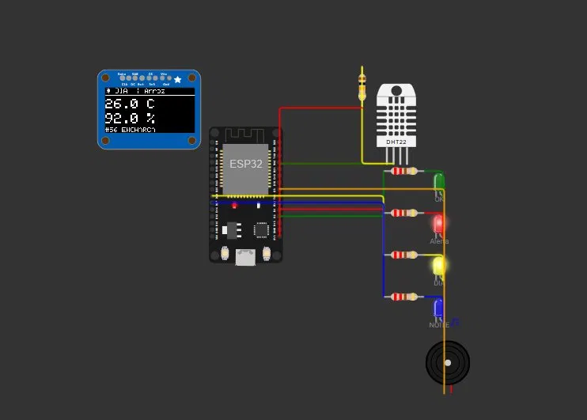
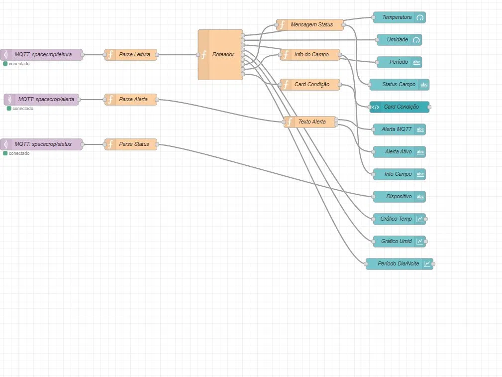
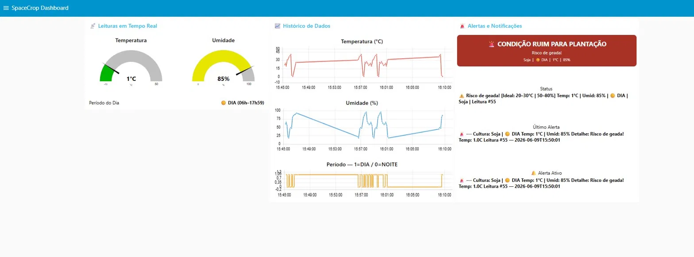

# 🌾 SpaceCrop IoT — Monitoramento Agrícola Inteligente

> **FIAP 2026 — Disruptive Architectures: IoT, IoB & Generative IA**


---

## 📋 Descrição do Projeto

O **SpaceCrop IoT** é um sistema de monitoramento agrícola em tempo real inspirado em tecnologias de observação orbital e agricultura de precisão. O projeto utiliza um microcontrolador **ESP32** com sensor de temperatura e umidade **DHT22** para capturar leituras periódicas e transmiti-las via protocolo **MQTT** para um dashboard **Node-RED**, onde os dados são visualizados, condições analisadas e alertas disparados de acordo com o estado climático da plantação.

O problema real que o projeto busca resolver é a **dificuldade de pequenos e médios produtores rurais em monitorar continuamente as condições climáticas de suas lavouras** — variações de temperatura e umidade que indicam risco de geada, seca, calor excessivo ou encharcamento costumam ser percebidas tarde, gerando perdas evitáveis. O SpaceCrop oferece monitoramento contínuo, identificação automática da condição por cultura e alertas imediatos com indicação visual e sonora no dispositivo.

---

## 👥 Equipe

| Nome | RM |
|---|---|
| Lucas Grillo Alcântara | 561413 |
| Pietro Ferreira Gomes Abrahamian | 561469 |
| Pedro Peres Benitez | 561792 |
| Lucca Ramos Mussumecci | 562027 |

---

## Link do GitHub
https://github.com/Benitez561792/SpaceCrop-IOT.git


## 🎬 Demonstração em Vídeo

> *((https://www.youtube.com/watch?v=j2JCF0OddFg))*

---

## 🎯 Objetivos

### Objetivo Principal
Desenvolver um protótipo funcional simulado que utilize tecnologias de IoT para monitoramento agrícola de temperatura e umidade, com dashboard em tempo real via protocolo MQTT e alertas automáticos por condição climática.

### Objetivos Específicos
- Demonstrar o funcionamento do sensor DHT22 conectado ao ESP32 via Wokwi
- Transmitir dados via MQTT (broker público HiveMQ) em três tópicos distintos: leitura, alerta e status
- Exibir os dados em dashboard Node-RED com gauges, card de condição, gráficos históricos e alertas
- Simular 15 cenários climáticos reais cobrindo 5 culturas (Soja, Milho, Trigo, Cana, Arroz) com condições variadas
- Alternar período DIA/NOITE aleatoriamente a cada leitura para demonstrar cobertura completa de monitoramento
- Evidenciar a viabilidade técnica do projeto como prova de conceito para integração futura com APIs da NASA/ESA

---

## 🏗️ Arquitetura do Sistema

```
┌─────────────────┐     WiFi      ┌──────────────────┐     MQTT      ┌───────────────────┐
│  ESP32 +        │ ────────────► │  HiveMQ Public   │ ────────────► │  Node-RED         │
│  DHT22 + OLED   │               │  Broker          │               │  Dashboard        │
│  (Wokwi)        │               │  broker.hivemq   │               │  (UI + Alertas)   │
└─────────────────┘               │  .com:1883       │               └───────────────────┘
     │                            └──────────────────┘
     │
     ├── LED Verde   (GPIO 2)  → Condição IDEAL
     ├── LED Vermelho (GPIO 4) → Alerta climático ativo
     ├── LED Amarelo  (GPIO 26)→ Período DIA
     ├── LED Azul     (GPIO 27)→ Período NOITE
     └── Buzzer       (GPIO 5) → Alertas sonoros por severidade
```

**Tópicos MQTT:**
- `spacecrop/leitura` — payload JSON completo com dados da leitura (temperatura, umidade, cultura, status, período)
- `spacecrop/alerta`  — payload JSON com alerta ativo, motivo detalhado e dados da leitura
- `spacecrop/status`  — heartbeat do dispositivo (IP, RSSI, uptime, timestamp)

---

## 🔧 Tecnologias Utilizadas

| Camada | Tecnologia |
|---|---|
| Hardware (simulado) | ESP32 DevKit V1, DHT22, 4 LEDs, Buzzer, Resistores, OLED SSD1306 |
| Simulador | [Wokwi](https://wokwi.com) |
| Firmware | Arduino / C++ |
| Comunicação | MQTT sobre WiFi (TCP/IP) |
| Broker MQTT | HiveMQ Public Broker (`broker.hivemq.com:1883`) |
| Dashboard | Node-RED + node-red-dashboard |
| Serialização | ArduinoJson |
| Display local | Adafruit SSD1306 (I2C 0x3C) |
| Sincronização de tempo | NTP (`pool.ntp.org`, GMT-3) |

### Bibliotecas Arduino
```
PubSubClient
DHTesp (dhtESP32-rmt)
ArduinoJson
WiFi (built-in ESP32)
Wire
Adafruit_GFX
Adafruit_SSD1306
```

---

## 🔌 Circuito — Pinagem

| Componente | Pino ESP32 | Observação |
|---|---|---|
| DHT22 — DATA | GPIO 15 | Pull-up 10kΩ externo + INPUT_PULLUP interno |
| DHT22 — VCC | 3.3V | — |
| DHT22 — GND | GND | — |
| LED Verde (IDEAL) | GPIO 2 | Resistor 220Ω série |
| LED Vermelho (Alerta) | GPIO 4 | Resistor 220Ω série |
| LED Amarelo (DIA) | GPIO 26 | Resistor 220Ω série |
| LED Azul (NOITE) | GPIO 27 | Resistor 220Ω série |
| Buzzer piezoelétrico | GPIO 5 | Ativo direto |
| OLED SSD1306 — SDA | GPIO 21 | I2C |
| OLED SSD1306 — SCL | GPIO 22 | I2C |
| OLED SSD1306 — VCC | 3.3V | — |
| OLED SSD1306 — GND | GND | — |



> Circuito simulado no Wokwi: ESP32 conectado ao DHT22 (GPIO 15), LED Verde/IDEAL (GPIO 2), LED Vermelho/Alerta (GPIO 4), LED Amarelo/DIA (GPIO 26), LED Azul/NOITE (GPIO 27), Buzzer (GPIO 5) e display OLED SSD1306 via I2C (SDA=21, SCL=22).

---

## 🌱 Lógica de Status Agrícola

O firmware classifica a leitura de temperatura e umidade em cinco estados, com comportamento distinto de LED e buzzer para cada um:

| Status | Condição | LED | Buzzer |
|---|---|---|---|
| `IDEAL` | Temp 5–35°C e Umid 30–90% | Verde fixo | Silencioso |
| `GEADA` | Temp ≤ 5°C | Vermelho piscando rápido (120ms) | Bip longo e urgente (700ms ON) |
| `CALOR` | Temp ≥ 35°C | Vermelho fixo | Intermitente moderado (200ms ON / 400ms OFF) |
| `SECA` | Umid ≤ 30% | Vermelho piscando lento (600ms) | 1 bip curto a cada 2s |
| `ENCHARCA` | Umid ≥ 90% | Vermelho piscando rápido (120ms) | Intermitente moderado |

### Culturas e Cenários Simulados

O firmware percorre 15 cenários em loop, cobrindo condições ideais e todas as situações de alerta:

| # | Cultura | Temp (°C) | Umid (%) | Status esperado |
|---|---|---|---|---|
| 1 | Soja | 22.0 | 60 | IDEAL |
| 2 | Milho | 24.5 | 65 | IDEAL |
| 3 | Trigo | 20.0 | 55 | IDEAL |
| 4 | Soja | 30.0 | 22 | SECA |
| 5 | Milho | 31.5 | 18 | SECA |
| 6 | Soja | 36.0 | 45 | CALOR |
| 7 | Cana | 38.2 | 50 | CALOR |
| 8 | Milho | 40.1 | 48 | CALOR |
| 9 | Trigo | 3.5 | 80 | GEADA |
| 10 | Soja | 1.0 | 85 | GEADA |
| 11 | Arroz | 26.0 | 92 | ENCHARCA |
| 12 | Milho | 25.0 | 95 | ENCHARCA |
| 13 | Soja | 27.0 | 68 | IDEAL |
| 14 | Trigo | 23.5 | 62 | IDEAL |
| 15 | Cana | 21.0 | 58 | IDEAL |

---

## 📊 Dashboard Node-RED

O flow Node-RED (`nodered-flow-wokwi.json`) implementa:

- **Gauge de Temperatura** — exibe temperatura em tempo real (-10 a 50°C) com faixas coloridas
- **Gauge de Umidade** — exibe umidade relativa (0–100%)
- **Período do Dia** — texto com ícone ☀️ DIA ou 🌙 NOITE, atualizado a cada leitura
- **Card de Condição** — painel verde (IDEAL) ou vermelho (alerta) com texto da condição, cultura, temperatura e umidade
- **Status do Campo** — linha de texto com condição, faixa ideal da cultura e número da leitura
- **Informações do Campo** — cultura, período, código da condição e timestamp
- **Dispositivo** — IP, RSSI, uptime e timestamp do heartbeat
- **Gráfico de Temperatura** — histórico em linha das últimas 60 leituras
- **Gráfico de Umidade** — histórico em linha das últimas 60 leituras
- **Gráfico Período DIA/NOITE** — histórico em degrau (1=DIA / 0=NOITE)
- **Último Alerta** e **Alerta Ativo** — painéis de texto exibindo o alerta mais recente com detalhes completos

### Grupos do Dashboard

| Grupo | Conteúdo |
|---|---|
| 📊 Leituras em Tempo Real | Gauges de temperatura e umidade, período do dia |
| 🚨 Alertas e Condição | Card de condição, status do campo, alertas MQTT e alerta ativo |
| 📈 Histórico de Dados | Gráficos de temperatura, umidade e período |
| 🌾 Informações do Campo | Info da cultura/período e dados do dispositivo |



> Flow completo: 3 entradas MQTT (leitura, alerta, status) → parse e roteamento → gauges, card de condição, gráficos históricos, alertas e informações do dispositivo.



> Dashboard exibindo temperatura (1°C — risco de geada), umidade (85%), card vermelho de condição ruim, gráficos históricos de temperatura e umidade, e painel de alertas ativos com detalhes da leitura.

---

## 📦 Payload MQTT (JSON)

### Tópico `spacecrop/leitura`
```json
{
  "device": "spacecrop-00a1b2c3",
  "cultura": "Soja",
  "temperatura": 36.0,
  "umidade": 45.0,
  "status": "CALOR",
  "periodo": "NOITE",
  "leitura": 6,
  "timestamp": "2026-06-09T14:22:10"
}
```

### Tópico `spacecrop/alerta`
```json
{
  "alerta_ativo": true,
  "status": "CALOR",
  "motivo": "Calor excessivo! Temp: 36.0C",
  "cultura": "Soja",
  "temperatura": 36.0,
  "umidade": 45.0,
  "periodo": "NOITE",
  "leitura": 6,
  "timestamp": "2026-06-09T14:22:10"
}
```

### Tópico `spacecrop/status`
```json
{
  "online": true,
  "uptime_s": 24,
  "ip": "10.10.0.2",
  "rssi": -62,
  "timestamp": "2026-06-09T14:22:10"
}
```

---

## 🚀 Como Executar

### 1. Simulação no Wokwi

1. Acesse [wokwi.com](https://wokwi.com) e crie um novo projeto ESP32
2. Importe os arquivos:
   - `sketch-simulado.ino` → código principal
   - `diagram.json` → circuito com todos os componentes
3. Clique em **Run** para iniciar a simulação
4. O ESP32 conectará automaticamente à rede `Wokwi-GUEST`
5. Os dados serão publicados no broker HiveMQ a cada **4 segundos**

### 2. Dashboard Node-RED

**Pré-requisitos:**
```bash
# Instalar Node-RED
npm install -g node-red

# Instalar dependências de dashboard
cd ~/.node-red
npm install node-red-dashboard
```

**Importar o flow:**
1. Abra o Node-RED (`http://localhost:1880`)
2. Menu ☰ → **Import** → cole o conteúdo de `nodered-flow-wokwi.json`
3. Clique em **Deploy**
4. Acesse o dashboard em `http://localhost:1880/ui`

### 3. Teste sem ESP32 (HiveMQ Websocket Client)

Para testar o dashboard sem o Wokwi, acesse o [HiveMQ Websocket Client](https://www.hivemq.com/demos/websocket-client/), conecte em `broker.hivemq.com:8884` e publique manualmente nos tópicos `spacecrop/leitura`, `spacecrop/alerta` e `spacecrop/status` com os payloads de exemplo acima.

---


## 🛰️ Conexão com o Tema — Tecnologia Espacial Aplicada

A SpaceCrop é inspirada no conceito de **agricultura de precisão baseada em observação da Terra** — a mesma abordagem utilizada por satélites da NASA e da ESA para monitorar safras em escala global. O sistema foi arquitetado para futuramente integrar:

- **NASA Earthdata API** — dados de temperatura de superfície e índice de vegetação (NDVI)
- **ESA Copernicus** — imagens de satélite para detecção de estresse hídrico
- **INMET/OpenWeatherMap** — previsão climática regional para alertas preditivos

Isso conecta diretamente com o tema da Global Solution: tecnologia espacial aplicada para resolver problemas reais na Terra, com foco em sustentabilidade e segurança alimentar.

---

## 📄 Licença

Projeto acadêmico — FIAP 2026. Todos os direitos reservados à equipe.
